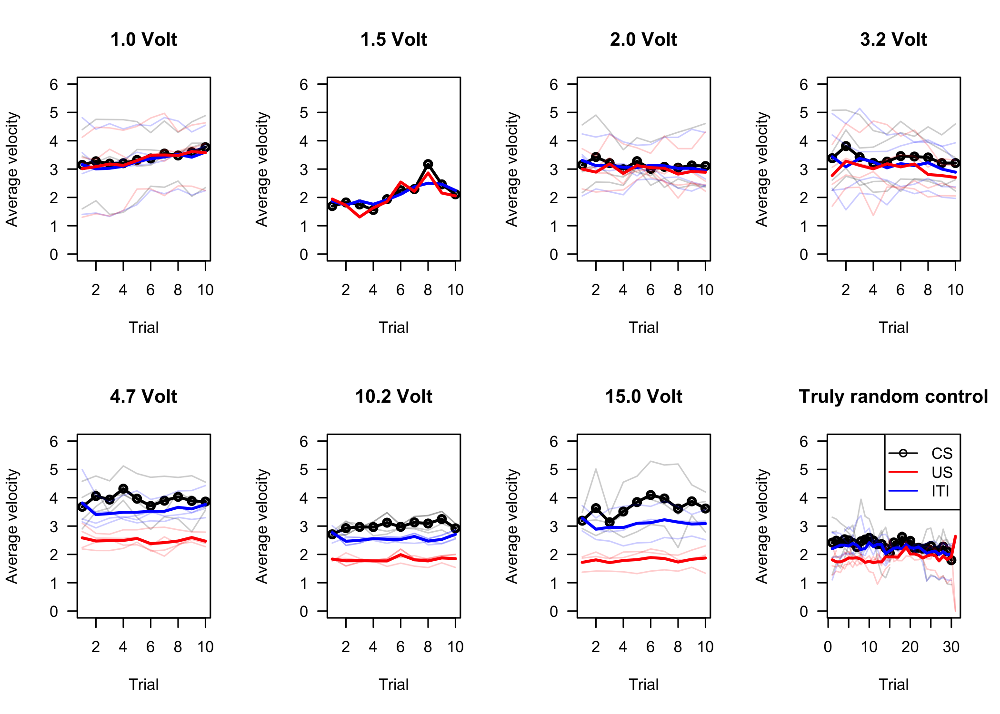

# Group level analysis

- [Helper functions](#helper-functions)
- [Create meta data table](#create-meta-data-table)
- [Load data](#load-data)
- [Plot everything](#plot-everything)

## Helper functions

First lets make some aggregation functions and plotting functions. The
processed data ready for analysis is in the folder `./processed`.

``` r
#' Calculate Average Velocity
#'
#' This function calculates the average velocity for each unique trial given a log data frame and a tracking data frame.
#'
#' @param log_df A data frame containing log data with columns 'trial', 'stimulus', and 'frame'.
#' @param tracking_df A data frame containing tracking data with columns 'frame' and 'velocity'.
#' @param event_type A string specifying the type of event to filter the log data by (e.g., "US").
#' @param add.onset An integer value to adjust the onset frame by a certain number of milliseconds. Default is 0.
#' @param add.offset An integer value to adjust the offset frame by a certain number of milliseconds. Default is 0.
#' @param fps An integer value describing the frame rate per second of the video. Default is 30 frames per second.
#'
#' @return A numeric vector containing the average velocities for each unique trial.
#'
#' @examples
#' log_data <- data.frame(trial = c(1, 1, 2, 2), stimulus = c("US", "US", "US", "US"), frame = c(10, 20, 30, 40))
#' tracking_data <- data.frame(frame = 1:50, velocity = runif(50))
#' calculateAverageVelocity(log_data, tracking_data, "US")
#'
#' @export
calculateAverageVelocity <- function(log_df, tracking_df, event_type, add.onset = 0, add.offset = 0, fps = 30) {
  unique_trials <- as.integer(na.omit(unique(log_df$trial)))
  avg_velocities <- numeric(length(unique_trials))  # Vector to store average velocities for each trial
  
  for (i in seq_along(unique_trials)) {
    trial <- unique_trials[i]
    
    # Filter log_df for the current trial and event type
    trial_data <- log_df[log_df$stimulus == event_type, ]
    
    # Find the onset and offset frames for each unique US event
    onsets <- trial_data$frame[seq(1, length(trial_data$frame), by = 2)]
    offsets <- trial_data$frame[seq(2, length(trial_data$frame), by = 2)]  # Offset is the frame before the next event or the last frame
    
    # Extract velocities between onset and offset for each unique US event
    event_velocities <- c()
    for (j in seq_along(onsets)) {
      onset_frame <- onsets[j]
      offset_frame <- offsets[j]
      
      # Extract velocities for the frames in between onset and offset
      velocities <- tracking_df$velocity[(tracking_df$frame >= (onset_frame - (add.onset / fps))) & (tracking_df$frame <= (offset_frame - (add.offset / fps)))]
      velocities <- mean(velocities, na.rm = TRUE)
      # Append velocities to the vector
      event_velocities <- c(event_velocities, velocities)
    }
    
    # Calculate the average velocity for the trial
  }
  
  return(event_velocities)
}
```

Then a plotting function:

``` r
#' Plot Data for a Given Voltage
#'
#' This function generates a plot of average velocities for a given voltage level. It plots the average post-stimulus velocities, and adds lines for pre-stimulus and US-stimulus velocities.
#'
#' @param data A data frame containing the columns 'numeric_voltages', 'post', 'pre', 'us', and 'trail'.
#' @param voltage A numeric value specifying the voltage level to filter the data by.
#' @param title A string specifying the title of the plot.
#'
#' @return This function does not return a value. It generates a plot.
#'
#' @examples
#' data <- data.frame(
#'   numeric_voltages = rep(c(1000, 1500, 2200), each = 10),
#'   post = runif(30, 1, 5),
#'   pre = runif(30, 1, 5),
#'   us = runif(30, 1, 5),
#'   trail = rep(1:10, 3)
#' )
#' plot_data_for_voltage(data, 1000, "1.0 Volt")
#'
#' @export
plot_data_for_voltage <- function(data, voltage, title) {
  # Filter the data for the specified voltage
  subset_data <- data[data$numeric_voltages == voltage, ]
  
  y <- tapply(subset_data$post, subset_data$trial, mean, na.rm = TRUE)
  x <- tapply(subset_data$pre, subset_data$trial, mean, na.rm = TRUE)
  z <- tapply(subset_data$us, subset_data$trial, mean, na.rm = TRUE)
  

  # Use aggregate to calculate the mean post-stimulus velocities for each combination of sample and trial
  aggregated_data <- aggregate(post ~ sample + trial, data = subset_data, FUN = mean, na.rm = TRUE)
  
  # Identify the missing combinations of sample and trial
  all_combinations <- expand.grid(sample = na.omit(unique(subset_data$sample)), trial = na.omit(unique(subset_data$trial)))
  present_combinations <- paste(aggregated_data$sample, aggregated_data$trial)
  #is_missing <- !(paste(all_combinations$sample, all_combinations$trail) %in% present_combinations)
  
  # Convert the aggregated data into a matrix
  ymat <- xtabs(post ~ sample + trial, data = aggregated_data)
  is_missing <- which(ymat == 0.0, arr.ind = TRUE)
  
  
  ymat[is_missing] <- NA
  
  aggregated_data.pre <- aggregate(pre ~ sample + trial, data = subset_data, FUN = mean, na.rm = TRUE)
  aggregated_data.us <- aggregate(us ~ sample + trial, data = subset_data, FUN = mean, na.rm = TRUE)
  xmat <- xtabs(pre ~ sample + trial, data = aggregated_data.pre)
  zmat <- xtabs(us ~ sample + trial, data = aggregated_data.us)
  
  xmat[is_missing] <- NA
  zmat[is_missing] <- NA
  

  plot(y, type = 'o', ylab = 'Average velocity', xlab = 'Trial', las = 1, ylim = c(0, 6), main = title, lwd=2)
  apply(ymat, 1, function(x){lines(x, col=rgb(0,0,0,0.2))})
  apply(xmat, 1, function(x){lines(x, col=rgb(0,0,1,0.2))})
  apply(zmat, 1, function(x){lines(x, col=rgb(1,0,0,0.2))})
  lines(x, col = 'blue', lwd=2)
  lines(z, col = 'red', lwd=2)
}
```

## Create meta data table

Next lets get a meta data file of all the data we will use:

``` r
meta<-do.call("rbind", strsplit(dir('./processed/'), '_'))
#exclude samples where video crashed (missing data, 1.5V Sample00 and 15V Sample00), corresponding to 17,18 and 25,26
meta <- meta[-c(17,18, 25, 26),]
#show the meta data table
head(meta)
```

         [,1]     [,2]       [,3]            
    [1,] "1000mV" "Sample00" "behavior.csv"  
    [2,] "1000mV" "Sample00" "timestamps.csv"
    [3,] "1000mV" "Sample01" "behavior.csv"  
    [4,] "1000mV" "Sample01" "timestamps.csv"
    [5,] "1000mV" "Sample02" "behavior.csv"  
    [6,] "1000mV" "Sample02" "timestamps.csv"

## Load data

Lets load all the processed data into a data frame `data`:

``` r
data<-data.frame(post = numeric(), pre = numeric(), us = numeric(), trial = integer(), volt = character(), sample = character())

for (i in seq(1, nrow(meta), by = 2)) {
  
  dat <- read.table(paste0('./processed/', meta[i, 1], '_', meta[i, 2] ,'_behavior.csv'), header = TRUE, sep = ',')
  log <- read.table(paste0('./processed/', meta[i, 1], '_', meta[i, 2] ,'_timestamps.csv'), header = TRUE, sep = ',')
  
  post <- calculateAverageVelocity(log, dat, 'CS', add.offset = 2000)
  pre <- calculateAverageVelocity(log, dat, 'CS', add.onset = 10000, add.offset = 4000)
  us <- calculateAverageVelocity(log, dat, 'US')
  
  # Determine max length of vectors
  max_len <- max(length(post), length(pre), length(us))
  
  # Populate NA values for missing
  post <- c(post, rep(NA, max_len - length(post)))
  pre <- c(pre, rep(NA, max_len - length(pre)))
  us <- c(us, rep(NA, max_len - length(us)))
  trial <- seq_along(post)
  
  # create data frae and append to previous
  data <- rbind(data, data.frame(post, pre, us, trial, volt = rep(meta[i, 1], max_len), sample = rep(meta[i, 2], max_len)))
}

#create numerical value with voltages in millivolts
data$numeric_voltages <- as.numeric(gsub("mV", "", data$volt))
```

    Warning: NAs introduced by coercion

``` r
#set truly random control to -1 mV just to distinguish it, otherwise Truly Random Control was done with 4.7 V.
data$numeric_voltages[is.na(data$numeric_voltages)]<- (-1)
```

## Plot everything

``` r
# Set up the plotting area
par(mfrow = c(2, 4))

# Call the function for each voltage value
plot_data_for_voltage(data, 1000, "1.0 Volt")
plot_data_for_voltage(data, 1500, "1.5 Volt")
plot_data_for_voltage(data, 2200, "2.0 Volt")
plot_data_for_voltage(data, 3200, "3.2 Volt")
plot_data_for_voltage(data, 4700, "4.7 Volt")
plot_data_for_voltage(data, 10200, "10.2 Volt")
plot_data_for_voltage(data, 15000, "15.0 Volt")
plot_data_for_voltage(data, -1, "Truly random control")


# Add a legend
legend('topright', c('CS', 'US', 'ITI'), lty = c(1), pch = c(1, NA, NA), col = c('black', 'red', 'blue'))
```


